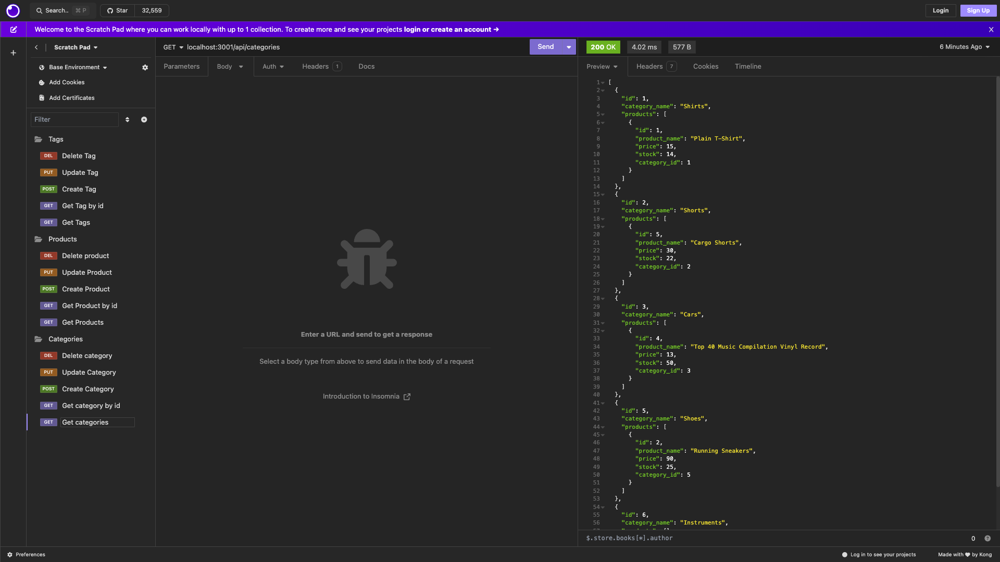
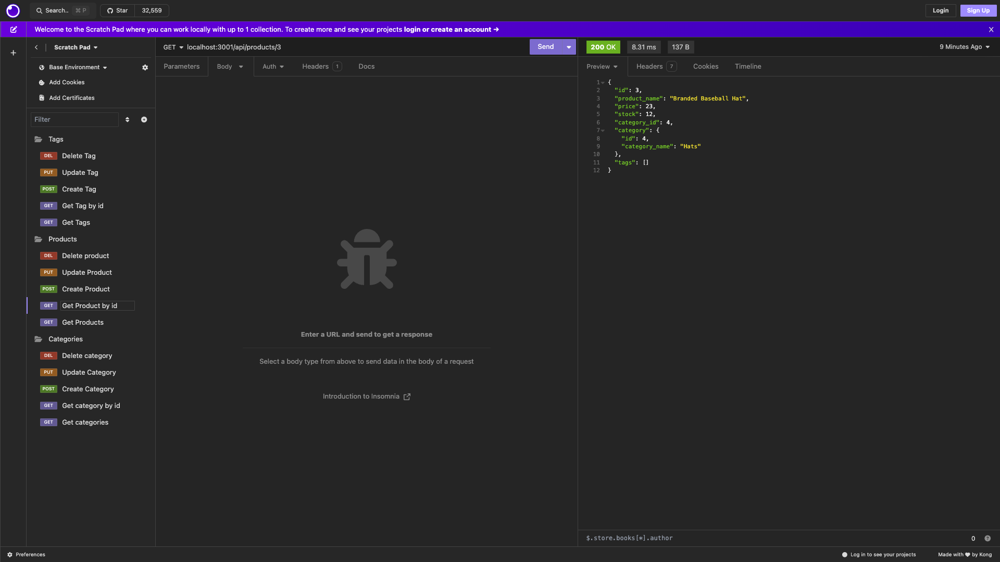
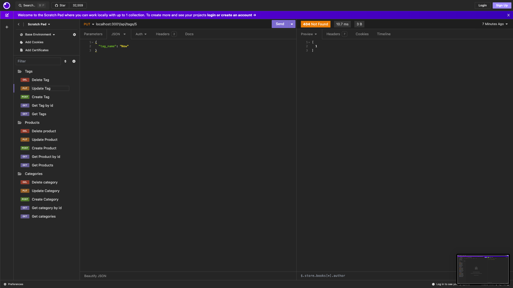
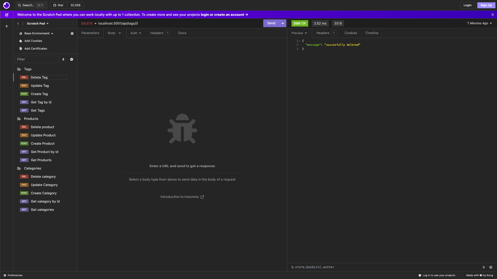

# Ecomm Back End

 

 ## Description
The Ecomm Back End allows a user to view all, view by id and to create, update and delete products, categories and tags using mySQL, Node, Express and Sequilize. 

  ## Installation 
  Since this is a backend only applications all use will be done on an API development platform like Insomnia to demonstrate its functional routes. Once the repo has been cloned to your local machine you can run `npm i` in your terminal to install all dependencies. To seed the DB run `npm run seed` in your terminal. Then to start the server you will run `npm start` in your terminal. Then you may begin your testing.

  ## Usage
    To see the app in action you will need to setup the appropriate paths as your URLs in you API development platform to be able to GET, POST, PUT and DELETE for tags, products and categories.

  Get All EX:
  
  Get by ID ex:
  
  Create ex:
  
  Update ex:
  
  Delete ex:
  

[Demo Video](https://drive.google.com/file/d/1eP9Ap23-6LexJnBa5eYURnFnKmf5K0il/view)

  ## License
  MIT License

  ## How to Contribute
  Feel free to contact me with any ideas.

  ## Questions
  [Github Profile](https://github.com/garrethil)

  For any further questions you may contact me at this email: garrethildebrandt@gmail.com
